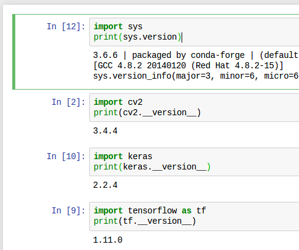

Jupyter notebook docker image with Python, OpenCV and Tensorflow for Deep Learning development.

### What packages were included in the image



### Run the pre-built image

Go to the [Docker Hub](https://hub.docker.com/r/alangtw/jupyter-opencv-tf/)

```bash
git clone https://github.com/a-lang/docker-opencv-tensorflow.git
docker run -it --name=jupyter -p 8888:8888 -v $PWD/notebook:/home/jovyan/work alangtw/jupyter-opencv-tf:181206
```

alternatively,

```bash
./run.sh
```

### Get the token info of Jupyter Notebook web

```bash
docker exec -it jupyter jupyter notebook list
```

### Build the image (optional)

```bash
docker build -t jupyter-opencv-tf .
```

