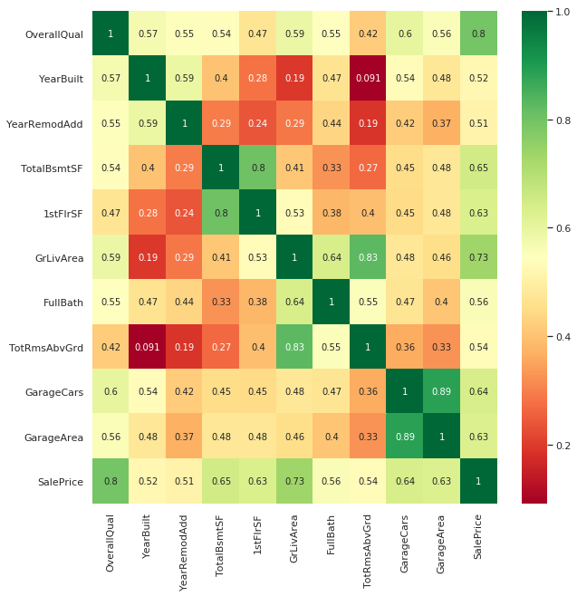

# 房屋分析及房價預測

從成交資料裡收集了 79 項各種不同的房屋特徵與交易價格的樣本數據，必須對測試樣本裡的房屋清單預測它們的房價。


```python
# 資料載入模組
import numpy as np # linear algebra
import pandas as pd # data processing, CSV file I/O (e.g. pd.read_csv)
import os

# 不要顯示惱人的 warning 訊息
import warnings
warnings.filterwarnings('ignore')

# 在 Notebook 裡可即時繪圖
%matplotlib inline  
```

## 載入與檢視樣本資料


```python
train = pd.read_csv("../input/train.csv")
test = pd.read_csv("../input/test.csv")

train.describe()
```


<div>
<style scoped>
    .dataframe tbody tr th:only-of-type {
        vertical-align: middle;
    }

    .dataframe tbody tr th {
        vertical-align: top;
    }

    .dataframe thead th {
        text-align: right;
    }
</style>
<table border="1" class="dataframe">
  <thead>
    <tr style="text-align: right;">
      <th></th>
      <th>Id</th>
      <th>MSSubClass</th>
      <th>LotFrontage</th>
      <th>LotArea</th>
      <th>OverallQual</th>
      <th>OverallCond</th>
      <th>YearBuilt</th>
      <th>YearRemodAdd</th>
      <th>MasVnrArea</th>
      <th>BsmtFinSF1</th>
      <th>...</th>
      <th>WoodDeckSF</th>
      <th>OpenPorchSF</th>
      <th>EnclosedPorch</th>
      <th>3SsnPorch</th>
      <th>ScreenPorch</th>
      <th>PoolArea</th>
      <th>MiscVal</th>
      <th>MoSold</th>
      <th>YrSold</th>
      <th>SalePrice</th>
    </tr>
  </thead>
  <tbody>
    <tr>
      <th>count</th>
      <td>1460.000000</td>
      <td>1460.000000</td>
      <td>1201.000000</td>
      <td>1460.000000</td>
      <td>1460.000000</td>
      <td>1460.000000</td>
      <td>1460.000000</td>
      <td>1460.000000</td>
      <td>1452.000000</td>
      <td>1460.000000</td>
      <td>...</td>
      <td>1460.000000</td>
      <td>1460.000000</td>
      <td>1460.000000</td>
      <td>1460.000000</td>
      <td>1460.000000</td>
      <td>1460.000000</td>
      <td>1460.000000</td>
      <td>1460.000000</td>
      <td>1460.000000</td>
      <td>1460.000000</td>
    </tr>
    <tr>
      <th>mean</th>
      <td>730.500000</td>
      <td>56.897260</td>
      <td>70.049958</td>
      <td>10516.828082</td>
      <td>6.099315</td>
      <td>5.575342</td>
      <td>1971.267808</td>
      <td>1984.865753</td>
      <td>103.685262</td>
      <td>443.639726</td>
      <td>...</td>
      <td>94.244521</td>
      <td>46.660274</td>
      <td>21.954110</td>
      <td>3.409589</td>
      <td>15.060959</td>
      <td>2.758904</td>
      <td>43.489041</td>
      <td>6.321918</td>
      <td>2007.815753</td>
      <td>180921.195890</td>
    </tr>
    <tr>
      <th>std</th>
      <td>421.610009</td>
      <td>42.300571</td>
      <td>24.284752</td>
      <td>9981.264932</td>
      <td>1.382997</td>
      <td>1.112799</td>
      <td>30.202904</td>
      <td>20.645407</td>
      <td>181.066207</td>
      <td>456.098091</td>
      <td>...</td>
      <td>125.338794</td>
      <td>66.256028</td>
      <td>61.119149</td>
      <td>29.317331</td>
      <td>55.757415</td>
      <td>40.177307</td>
      <td>496.123024</td>
      <td>2.703626</td>
      <td>1.328095</td>
      <td>79442.502883</td>
    </tr>
    <tr>
      <th>min</th>
      <td>1.000000</td>
      <td>20.000000</td>
      <td>21.000000</td>
      <td>1300.000000</td>
      <td>1.000000</td>
      <td>1.000000</td>
      <td>1872.000000</td>
      <td>1950.000000</td>
      <td>0.000000</td>
      <td>0.000000</td>
      <td>...</td>
      <td>0.000000</td>
      <td>0.000000</td>
      <td>0.000000</td>
      <td>0.000000</td>
      <td>0.000000</td>
      <td>0.000000</td>
      <td>0.000000</td>
      <td>1.000000</td>
      <td>2006.000000</td>
      <td>34900.000000</td>
    </tr>
    <tr>
      <th>25%</th>
      <td>365.750000</td>
      <td>20.000000</td>
      <td>59.000000</td>
      <td>7553.500000</td>
      <td>5.000000</td>
      <td>5.000000</td>
      <td>1954.000000</td>
      <td>1967.000000</td>
      <td>0.000000</td>
      <td>0.000000</td>
      <td>...</td>
      <td>0.000000</td>
      <td>0.000000</td>
      <td>0.000000</td>
      <td>0.000000</td>
      <td>0.000000</td>
      <td>0.000000</td>
      <td>0.000000</td>
      <td>5.000000</td>
      <td>2007.000000</td>
      <td>129975.000000</td>
    </tr>
    <tr>
      <th>50%</th>
      <td>730.500000</td>
      <td>50.000000</td>
      <td>69.000000</td>
      <td>9478.500000</td>
      <td>6.000000</td>
      <td>5.000000</td>
      <td>1973.000000</td>
      <td>1994.000000</td>
      <td>0.000000</td>
      <td>383.500000</td>
      <td>...</td>
      <td>0.000000</td>
      <td>25.000000</td>
      <td>0.000000</td>
      <td>0.000000</td>
      <td>0.000000</td>
      <td>0.000000</td>
      <td>0.000000</td>
      <td>6.000000</td>
      <td>2008.000000</td>
      <td>163000.000000</td>
    </tr>
    <tr>
      <th>75%</th>
      <td>1095.250000</td>
      <td>70.000000</td>
      <td>80.000000</td>
      <td>11601.500000</td>
      <td>7.000000</td>
      <td>6.000000</td>
      <td>2000.000000</td>
      <td>2004.000000</td>
      <td>166.000000</td>
      <td>712.250000</td>
      <td>...</td>
      <td>168.000000</td>
      <td>68.000000</td>
      <td>0.000000</td>
      <td>0.000000</td>
      <td>0.000000</td>
      <td>0.000000</td>
      <td>0.000000</td>
      <td>8.000000</td>
      <td>2009.000000</td>
      <td>214000.000000</td>
    </tr>
    <tr>
      <th>max</th>
      <td>1460.000000</td>
      <td>190.000000</td>
      <td>313.000000</td>
      <td>215245.000000</td>
      <td>10.000000</td>
      <td>9.000000</td>
      <td>2010.000000</td>
      <td>2010.000000</td>
      <td>1600.000000</td>
      <td>5644.000000</td>
      <td>...</td>
      <td>857.000000</td>
      <td>547.000000</td>
      <td>552.000000</td>
      <td>508.000000</td>
      <td>480.000000</td>
      <td>738.000000</td>
      <td>15500.000000</td>
      <td>12.000000</td>
      <td>2010.000000</td>
      <td>755000.000000</td>
    </tr>
  </tbody>
</table>
<p>8 rows × 38 columns</p>
</div>


```python
test.describe()
```


<div>
<style scoped>
    .dataframe tbody tr th:only-of-type {
        vertical-align: middle;
    }

    .dataframe tbody tr th {
        vertical-align: top;
    }

    .dataframe thead th {
        text-align: right;
    }
</style>
<table border="1" class="dataframe">
  <thead>
    <tr style="text-align: right;">
      <th></th>
      <th>Id</th>
      <th>MSSubClass</th>
      <th>LotFrontage</th>
      <th>LotArea</th>
      <th>OverallQual</th>
      <th>OverallCond</th>
      <th>YearBuilt</th>
      <th>YearRemodAdd</th>
      <th>MasVnrArea</th>
      <th>BsmtFinSF1</th>
      <th>...</th>
      <th>GarageArea</th>
      <th>WoodDeckSF</th>
      <th>OpenPorchSF</th>
      <th>EnclosedPorch</th>
      <th>3SsnPorch</th>
      <th>ScreenPorch</th>
      <th>PoolArea</th>
      <th>MiscVal</th>
      <th>MoSold</th>
      <th>YrSold</th>
    </tr>
  </thead>
  <tbody>
    <tr>
      <th>count</th>
      <td>1459.000000</td>
      <td>1459.000000</td>
      <td>1232.000000</td>
      <td>1459.000000</td>
      <td>1459.000000</td>
      <td>1459.000000</td>
      <td>1459.000000</td>
      <td>1459.000000</td>
      <td>1444.000000</td>
      <td>1458.000000</td>
      <td>...</td>
      <td>1458.000000</td>
      <td>1459.000000</td>
      <td>1459.000000</td>
      <td>1459.000000</td>
      <td>1459.000000</td>
      <td>1459.000000</td>
      <td>1459.000000</td>
      <td>1459.000000</td>
      <td>1459.000000</td>
      <td>1459.000000</td>
    </tr>
    <tr>
      <th>mean</th>
      <td>2190.000000</td>
      <td>57.378341</td>
      <td>68.580357</td>
      <td>9819.161069</td>
      <td>6.078821</td>
      <td>5.553804</td>
      <td>1971.357779</td>
      <td>1983.662783</td>
      <td>100.709141</td>
      <td>439.203704</td>
      <td>...</td>
      <td>472.768861</td>
      <td>93.174777</td>
      <td>48.313914</td>
      <td>24.243317</td>
      <td>1.794380</td>
      <td>17.064428</td>
      <td>1.744345</td>
      <td>58.167923</td>
      <td>6.104181</td>
      <td>2007.769705</td>
    </tr>
    <tr>
      <th>std</th>
      <td>421.321334</td>
      <td>42.746880</td>
      <td>22.376841</td>
      <td>4955.517327</td>
      <td>1.436812</td>
      <td>1.113740</td>
      <td>30.390071</td>
      <td>21.130467</td>
      <td>177.625900</td>
      <td>455.268042</td>
      <td>...</td>
      <td>217.048611</td>
      <td>127.744882</td>
      <td>68.883364</td>
      <td>67.227765</td>
      <td>20.207842</td>
      <td>56.609763</td>
      <td>30.491646</td>
      <td>630.806978</td>
      <td>2.722432</td>
      <td>1.301740</td>
    </tr>
    <tr>
      <th>min</th>
      <td>1461.000000</td>
      <td>20.000000</td>
      <td>21.000000</td>
      <td>1470.000000</td>
      <td>1.000000</td>
      <td>1.000000</td>
      <td>1879.000000</td>
      <td>1950.000000</td>
      <td>0.000000</td>
      <td>0.000000</td>
      <td>...</td>
      <td>0.000000</td>
      <td>0.000000</td>
      <td>0.000000</td>
      <td>0.000000</td>
      <td>0.000000</td>
      <td>0.000000</td>
      <td>0.000000</td>
      <td>0.000000</td>
      <td>1.000000</td>
      <td>2006.000000</td>
    </tr>
    <tr>
      <th>25%</th>
      <td>1825.500000</td>
      <td>20.000000</td>
      <td>58.000000</td>
      <td>7391.000000</td>
      <td>5.000000</td>
      <td>5.000000</td>
      <td>1953.000000</td>
      <td>1963.000000</td>
      <td>0.000000</td>
      <td>0.000000</td>
      <td>...</td>
      <td>318.000000</td>
      <td>0.000000</td>
      <td>0.000000</td>
      <td>0.000000</td>
      <td>0.000000</td>
      <td>0.000000</td>
      <td>0.000000</td>
      <td>0.000000</td>
      <td>4.000000</td>
      <td>2007.000000</td>
    </tr>
    <tr>
      <th>50%</th>
      <td>2190.000000</td>
      <td>50.000000</td>
      <td>67.000000</td>
      <td>9399.000000</td>
      <td>6.000000</td>
      <td>5.000000</td>
      <td>1973.000000</td>
      <td>1992.000000</td>
      <td>0.000000</td>
      <td>350.500000</td>
      <td>...</td>
      <td>480.000000</td>
      <td>0.000000</td>
      <td>28.000000</td>
      <td>0.000000</td>
      <td>0.000000</td>
      <td>0.000000</td>
      <td>0.000000</td>
      <td>0.000000</td>
      <td>6.000000</td>
      <td>2008.000000</td>
    </tr>
    <tr>
      <th>75%</th>
      <td>2554.500000</td>
      <td>70.000000</td>
      <td>80.000000</td>
      <td>11517.500000</td>
      <td>7.000000</td>
      <td>6.000000</td>
      <td>2001.000000</td>
      <td>2004.000000</td>
      <td>164.000000</td>
      <td>753.500000</td>
      <td>...</td>
      <td>576.000000</td>
      <td>168.000000</td>
      <td>72.000000</td>
      <td>0.000000</td>
      <td>0.000000</td>
      <td>0.000000</td>
      <td>0.000000</td>
      <td>0.000000</td>
      <td>8.000000</td>
      <td>2009.000000</td>
    </tr>
    <tr>
      <th>max</th>
      <td>2919.000000</td>
      <td>190.000000</td>
      <td>200.000000</td>
      <td>56600.000000</td>
      <td>10.000000</td>
      <td>9.000000</td>
      <td>2010.000000</td>
      <td>2010.000000</td>
      <td>1290.000000</td>
      <td>4010.000000</td>
      <td>...</td>
      <td>1488.000000</td>
      <td>1424.000000</td>
      <td>742.000000</td>
      <td>1012.000000</td>
      <td>360.000000</td>
      <td>576.000000</td>
      <td>800.000000</td>
      <td>17000.000000</td>
      <td>12.000000</td>
      <td>2010.000000</td>
    </tr>
  </tbody>
</table>
<p>8 rows × 37 columns</p>
</div>


### 檢視資料樣本大小(資料維度)
>(樣本數, 欄位數)


```python
print("Size of train data: {}".format(train.shape))
print("Size of test data: {}".format(test.shape))
```

    Size of train data: (1460, 81)
    Size of test data: (1459, 80)


### 從資料集裡去除 Id 欄位
> 欄位 Id 與後續的資料分析無關


```python
train_ID = train["Id"]
test_ID = test["Id"]

train.drop("Id", axis = 1, inplace = True)
test.drop("Id", axis = 1, inplace = True)
```


```python
print ("Size of train data after dropping Id: {}" .format(train.shape))
print ("Size of test data after dropping Id: {}" .format(test.shape))
```

    Size of train data after dropping Id: (1460, 80)
    Size of test data after dropping Id: (1459, 79)


### 處理 資料異常值(Outliers)
> 依據資料提供者的建議，將欄位 GrLiveArea 大於 4000 的值過濾掉。  


```python
# 資料視覺化模組
import matplotlib.pyplot as plt
import seaborn as sns

fig, ax = plt.subplots()
ax.scatter(x = train['GrLivArea'], y = train['SalePrice'])
plt.ylabel('SalePrice', fontsize=13)
plt.xlabel('GrLivArea', fontsize=13)
plt.show()
```


> 圖形顯示 GrLiveArea 大於 4000 有幾個異常低的房價數據。


```python
train = train.drop(train[(train['GrLivArea']>4000) & (train['SalePrice']<300000)].index)
```

### 資料關係矩陣
* 僅計算 數值型 欄位
* 計算所有 數值型 欄位與 SalePrice 的關係值 ( < 0.5 )


```python
# most correlated features
corrmat = train.corr()
top_corr_features = corrmat.index[abs(corrmat["SalePrice"])>0.5]
plt.figure(figsize=(10,10))
g = sns.heatmap(train[top_corr_features].corr(),annot=True,cmap="RdYlGn")
```





> 圖形顯示：影響 SalePrice 的前幾個特徵有 OverallQual, GrLivArea and TotalBsmtSF


```python
# SalePrice v.s. OverallQual
sns.barplot(train.OverallQual,train.SalePrice)
```


    <matplotlib.axes._subplots.AxesSubplot at 0x7fd4a9709c50>


```python
# SalePrice v.s. several main features
sns.set()
cols = ['SalePrice', 'OverallQual', 'GrLivArea', 'GarageCars', 'TotalBsmtSF', 'FullBath', 'YearBuilt']
sns.pairplot(train[cols], size = 2.5)
plt.show();
```


### 目標變數(SalePrice)的轉換


```python
# SalePrice 分佈圖
sns.distplot(train['SalePrice'])
```


    <matplotlib.axes._subplots.AxesSubplot at 0x7fd4a95798d0>


```python
# 偏度與峰度 (skewness and kurtosis)
print("Skewness: %f" % train['SalePrice'].skew())
print("Kurtosis: %f" % train['SalePrice'].kurt())
```

    Skewness: 1.881296
    Kurtosis: 6.523067


>峰度：峰度（Kurtosis）是描述某变量所有取值分布形态陡缓程度的统计量。  
>它是和正态分布相比较的。
>* Kurtosis=0 与正态分布的陡缓程度相同。
>* Kurtosis>0 比正态分布的高峰更加陡峭——尖顶峰
>* Kurtosis<0 比正态分布的高峰来得平台——平顶峰计算公式：β = M_4 /σ^4 偏度：

>偏度：偏度（Skewness）是描述某变量取值分布对称性的统计量。
>* Skewness=0 分布形态与正态分布偏度相同
>* Skewness>0 正偏差数值较大，为正偏或右偏。长尾巴拖在右边。
>* Skewness<0 负偏差数值较大，为负偏或左偏。长尾巴拖在左边。 计算公式： S= (X^ - M_0)/δ Skewness 越大，分布形态偏移程度越大。

#### 處理偏差(Skewness)
> 執行 log transform 修正偏差問題


```python
#We use the numpy fuction log1p which  applies log(1+x) to all elements of the column
train["SalePrice"] = np.log1p(train["SalePrice"])

print("Skewness after fix: %f" % train['SalePrice'].skew())
print("Kurtosis after fix: %f" % train['SalePrice'].kurt())

```

    Skewness after fix: 0.121580
    Kurtosis after fix: 0.804751


```python
# SalePrice 分佈圖（修正後）
sns.distplot(train['SalePrice'])
```


    <matplotlib.axes._subplots.AxesSubplot at 0x7fd4a9ecd400>


## 特徵工程
特徵工程是利用數據領域的相關知識來創建能夠使機器學習算法達到最佳性能的特徵的過程。

簡而言之，特徵工程就是一個把原始數據轉變成特徵的過程，這些特徵可以很好的描述這些數據，並且利用它們建立的模型在未知數據上的表現性能可以達到最優（或者接近最佳性能）。從數學的角度來看，特徵工程就是人工地去設計輸入變量X。

### 合併 train 與 test 資料集


```python
ntrain = train.shape[0]
ntest = test.shape[0]
y_train = train.SalePrice.values
all_data = pd.concat((train, test)).reset_index(drop=True)
all_data = all_data.drop(['SalePrice'], axis=1)
print("all_data size is : {}".format(all_data.shape))
```

    all_data size is : (2917, 79)


### 檢查缺值的資料(Missing Data)


```python
all_data_na = (all_data.isnull().sum() / len(all_data)) * 100
all_data_na = all_data_na.drop(all_data_na[all_data_na == 0].index).sort_values(ascending=False)[:30]
missing_data = pd.DataFrame({'Missing Ratio' :all_data_na})
missing_data
```


<div>
<style scoped>
    .dataframe tbody tr th:only-of-type {
        vertical-align: middle;
    }

    .dataframe tbody tr th {
        vertical-align: top;
    }

    .dataframe thead th {
        text-align: right;
    }
</style>
<table border="1" class="dataframe">
  <thead>
    <tr style="text-align: right;">
      <th></th>
      <th>Missing Ratio</th>
    </tr>
  </thead>
  <tbody>
    <tr>
      <th>PoolQC</th>
      <td>99.691464</td>
    </tr>
    <tr>
      <th>MiscFeature</th>
      <td>96.400411</td>
    </tr>
    <tr>
      <th>Alley</th>
      <td>93.212204</td>
    </tr>
    <tr>
      <th>Fence</th>
      <td>80.425094</td>
    </tr>
    <tr>
      <th>FireplaceQu</th>
      <td>48.680151</td>
    </tr>
    <tr>
      <th>LotFrontage</th>
      <td>16.660953</td>
    </tr>
    <tr>
      <th>GarageQual</th>
      <td>5.450806</td>
    </tr>
    <tr>
      <th>GarageCond</th>
      <td>5.450806</td>
    </tr>
    <tr>
      <th>GarageFinish</th>
      <td>5.450806</td>
    </tr>
    <tr>
      <th>GarageYrBlt</th>
      <td>5.450806</td>
    </tr>
    <tr>
      <th>GarageType</th>
      <td>5.382242</td>
    </tr>
    <tr>
      <th>BsmtExposure</th>
      <td>2.811107</td>
    </tr>
    <tr>
      <th>BsmtCond</th>
      <td>2.811107</td>
    </tr>
    <tr>
      <th>BsmtQual</th>
      <td>2.776826</td>
    </tr>
    <tr>
      <th>BsmtFinType2</th>
      <td>2.742544</td>
    </tr>
    <tr>
      <th>BsmtFinType1</th>
      <td>2.708262</td>
    </tr>
    <tr>
      <th>MasVnrType</th>
      <td>0.822763</td>
    </tr>
    <tr>
      <th>MasVnrArea</th>
      <td>0.788481</td>
    </tr>
    <tr>
      <th>MSZoning</th>
      <td>0.137127</td>
    </tr>
    <tr>
      <th>BsmtFullBath</th>
      <td>0.068564</td>
    </tr>
    <tr>
      <th>BsmtHalfBath</th>
      <td>0.068564</td>
    </tr>
    <tr>
      <th>Utilities</th>
      <td>0.068564</td>
    </tr>
    <tr>
      <th>Functional</th>
      <td>0.068564</td>
    </tr>
    <tr>
      <th>Electrical</th>
      <td>0.034282</td>
    </tr>
    <tr>
      <th>BsmtUnfSF</th>
      <td>0.034282</td>
    </tr>
    <tr>
      <th>Exterior1st</th>
      <td>0.034282</td>
    </tr>
    <tr>
      <th>Exterior2nd</th>
      <td>0.034282</td>
    </tr>
    <tr>
      <th>TotalBsmtSF</th>
      <td>0.034282</td>
    </tr>
    <tr>
      <th>GarageArea</th>
      <td>0.034282</td>
    </tr>
    <tr>
      <th>GarageCars</th>
      <td>0.034282</td>
    </tr>
  </tbody>
</table>
</div>


```python
f, ax = plt.subplots(figsize=(15, 12))
plt.xticks(rotation='90')
sns.barplot(x=all_data_na.index, y=all_data_na)
plt.xlabel('Features', fontsize=15)
plt.ylabel('Percent of missing values', fontsize=15)
plt.title('Percent missing data by feature', fontsize=15)
```


    Text(0.5,1,'Percent missing data by feature')


> * GarageQual, GarageCond, GarageFinish, GarageYrBlt, GarageType 有相同的比率。
> * BsmtExposure, BsmtCond, BsmtQual, BsmtFinType2, BsmtFinType2 有相同的比率。 

### 缺值資料的處理
PoolQC：依據作者的說明文件，沒有值表示該房子沒有泳池設施，所以對這欄位的所有空值填入 None。


```python
all_data["PoolQC"] = all_data["PoolQC"].fillna("None")
```

MscFeature: 文件上說，空值表示 "no misc feature"，所以對這欄位的所有空值填入 None。


```python
all_data["MiscFeature"] = all_data["MiscFeature"].fillna("None")
```

Alley：文件上說，空值表示 "no alley access"，所以對這欄位的所有空值填入 None。


```python
all_data["Alley"] = all_data["Alley"].fillna("None")
```

Fence：文件上說，空值表示 "no fence"，所以對這欄位的所有空值填入 None。


```python
all_data["Fence"] = all_data["Fence"].fillna("None")
```

FireplaceQu：文件上說，空值表示 "no fireplace"，所以對這欄位的所有空值填入 None。


```python
all_data["FireplaceQu"] = all_data["FireplaceQu"].fillna("None")
```

LotFrontage：猜測此欄可能與 Neighborhood(街道)互有關聯，同個街道的 LotFrontage 可能有相似的值，所以此欄的空值填入同個 Neighborhood 的 LotFrontage 中位數。


```python
#all_data.groupby('Neighborhood')['LotFrontage'].count()
grouped_df = all_data.groupby('Neighborhood')['LotFrontage']
for key, item in grouped_df:
    print(key,"\n")
    print(grouped_df.get_group(key))
    break
```

    Blmngtn 
    
    219     43.0
    229     43.0
    385     43.0
    443     53.0
    465      NaN
    558      NaN
    596     53.0
    638     53.0
    789     43.0
    850      NaN
    981     43.0
    1003    43.0
    1018    43.0
    1022    43.0
    1125    53.0
    1392    53.0
    1413    51.0
    1481    43.0
    1683    43.0
    1982     NaN
    1983     NaN
    1984    53.0
    2318     NaN
    2319    53.0
    2669    43.0
    2670     NaN
    2671     NaN
    2672    43.0
    Name: LotFrontage, dtype: float64


```python
#Group by neighborhood and fill in missing value by the median LotFrontage of all the neighborhood
all_data["LotFrontage"] = all_data.groupby("Neighborhood")["LotFrontage"].transform(
    lambda x: x.fillna(x.median()))
```

GarageType, GarageFinish, GarageQual and GarageCond : 文件上說，空值表示沒有停車位，所以對這欄位的所有空值填入 None。


```python
for col in ['GarageType', 'GarageFinish', 'GarageQual', 'GarageCond']:
    all_data[col] = all_data[col].fillna('None')
```


```python
abc = ['GarageType', 'GarageFinish', 'GarageQual', 'GarageCond','GarageYrBlt', 'GarageArea', 'GarageCars']
all_data.groupby('GarageType')[abc].count()
```


<div>
<style scoped>
    .dataframe tbody tr th:only-of-type {
        vertical-align: middle;
    }

    .dataframe tbody tr th {
        vertical-align: top;
    }

    .dataframe thead th {
        text-align: right;
    }
</style>
<table border="1" class="dataframe">
  <thead>
    <tr style="text-align: right;">
      <th></th>
      <th>GarageType</th>
      <th>GarageFinish</th>
      <th>GarageQual</th>
      <th>GarageCond</th>
      <th>GarageYrBlt</th>
      <th>GarageArea</th>
      <th>GarageCars</th>
    </tr>
    <tr>
      <th>GarageType</th>
      <th></th>
      <th></th>
      <th></th>
      <th></th>
      <th></th>
      <th></th>
      <th></th>
    </tr>
  </thead>
  <tbody>
    <tr>
      <th>2Types</th>
      <td>23</td>
      <td>23</td>
      <td>23</td>
      <td>23</td>
      <td>23</td>
      <td>23</td>
      <td>23</td>
    </tr>
    <tr>
      <th>Attchd</th>
      <td>1722</td>
      <td>1722</td>
      <td>1722</td>
      <td>1722</td>
      <td>1722</td>
      <td>1722</td>
      <td>1722</td>
    </tr>
    <tr>
      <th>Basment</th>
      <td>36</td>
      <td>36</td>
      <td>36</td>
      <td>36</td>
      <td>36</td>
      <td>36</td>
      <td>36</td>
    </tr>
    <tr>
      <th>BuiltIn</th>
      <td>185</td>
      <td>185</td>
      <td>185</td>
      <td>185</td>
      <td>185</td>
      <td>185</td>
      <td>185</td>
    </tr>
    <tr>
      <th>CarPort</th>
      <td>15</td>
      <td>15</td>
      <td>15</td>
      <td>15</td>
      <td>15</td>
      <td>15</td>
      <td>15</td>
    </tr>
    <tr>
      <th>Detchd</th>
      <td>779</td>
      <td>779</td>
      <td>779</td>
      <td>779</td>
      <td>777</td>
      <td>778</td>
      <td>778</td>
    </tr>
    <tr>
      <th>None</th>
      <td>157</td>
      <td>157</td>
      <td>157</td>
      <td>157</td>
      <td>0</td>
      <td>157</td>
      <td>157</td>
    </tr>
  </tbody>
</table>
</div>


GarageYrBlt, GarageArea and GarageCars : 文件上說，空值表示沒有停車位，所以對這數值型欄位的所有空值填入 0。


```python
for col in ('GarageYrBlt', 'GarageArea', 'GarageCars'):
    all_data[col] = all_data[col].fillna(0)
```

BsmtFinSF1, BsmtFinSF2, BsmtUnfSF, TotalBsmtSF, BsmtFullBath and BsmtHalfBath：文件上說，空值表示沒有地下室，所以對這數值型欄位的所有空值填入 0。


```python
# Check the data type of these columns
#all_data[['BsmtFinSF1', 'BsmtFinSF2', 'BsmtUnfSF', 'BsmtFullBath', 'BsmtHalfBath']].describe()

for col in ('BsmtFinSF1', 'BsmtFinSF2', 'BsmtUnfSF','TotalBsmtSF', 'BsmtFullBath', 'BsmtHalfBath'):
    all_data[col] = all_data[col].fillna(0)
```

BsmtQual, BsmtCond, BsmtExposure, BsmtFinType1 and BsmtFinType2：文件上說，空值表示沒有地下室，所以對這類別型欄位的所有空值填入 None。


```python
# Check the data type of these columns
#all_data[['BsmtQual', 'BsmtCond', 'BsmtExposure', 'BsmtFinType1', 'BsmtFinType2']].describe()

for col in ('BsmtQual', 'BsmtCond', 'BsmtExposure', 'BsmtFinType1', 'BsmtFinType2'):
    all_data[col] = all_data[col].fillna('None')
```

MasVnrArea and MasVnrType：對空值依資料類型，分別填入 0 或 None。


```python
all_data["MasVnrType"] = all_data["MasVnrType"].fillna("None")
all_data["MasVnrArea"] = all_data["MasVnrArea"].fillna(0)
```

MSZoning：文件沒有空值的說明，就填入出現最多次的值。


```python
all_data['MSZoning'].value_counts()
```


    RL         2263
    RM          460
    FV          139
    RH           26
    C (all)      25
    Name: MSZoning, dtype: int64


```python
# .mode() 眾數值
all_data['MSZoning'] = all_data['MSZoning'].fillna(all_data['MSZoning'].mode()[0])
```

Utilities：統計此欄的值，發現 99% 都一樣，所以不列入學習。


```python
all_data['Utilities'].value_counts()
```


    AllPub    2914
    NoSeWa       1
    Name: Utilities, dtype: int64


```python
all_data = all_data.drop(['Utilities'], axis=1)
```

Functional：依據文件，空值填入 Typ


```python
all_data['Functional'] = all_data['Functional'].fillna('Typ')
```

Electrical,KitchenQual, Exterior1st, Exterior2nd, SaleType：這些都是類別型的欄位，所以空值填入對應欄位的眾數值。****


```python
for col in ('Electrical', 'KitchenQual', 'Exterior1st', 'Exterior2nd', 'SaleType'):
    all_data[col] = all_data[col].fillna(all_data[col].mode()[0])
```

### 再一次檢查資料集的缺值


```python
#Check remaining missing values if any 
all_data_na = (all_data.isnull().sum() / len(all_data)) * 100
all_data_na = all_data_na.drop(all_data_na[all_data_na == 0].index).sort_values(ascending=False)
missing_data = pd.DataFrame({'Missing Ratio' :all_data_na})
missing_data.head()
```


<div>
<style scoped>
    .dataframe tbody tr th:only-of-type {
        vertical-align: middle;
    }

    .dataframe tbody tr th {
        vertical-align: top;
    }

    .dataframe thead th {
        text-align: right;
    }
</style>
<table border="1" class="dataframe">
  <thead>
    <tr style="text-align: right;">
      <th></th>
      <th>Missing Ratio</th>
    </tr>
  </thead>
  <tbody>
  </tbody>
</table>
</div>


### 類別型資料的處理
有些類別型欄位，但卻包含了數值型的資料。這會影響到機器學習，必須將它們轉換成字串型資料。


```python
#for cols in ('MSSubClass','OverallCond','YrSold','MoSold'):
#    all_data[cols] = all_data[cols].astype(str)
cols = ['MSSubClass','OverallCond','YrSold','MoSold']
all_data[cols] = all_data[cols].astype(str)
all_data[cols].describe()
```


<div>
<style scoped>
    .dataframe tbody tr th:only-of-type {
        vertical-align: middle;
    }

    .dataframe tbody tr th {
        vertical-align: top;
    }

    .dataframe thead th {
        text-align: right;
    }
</style>
<table border="1" class="dataframe">
  <thead>
    <tr style="text-align: right;">
      <th></th>
      <th>MSSubClass</th>
      <th>OverallCond</th>
      <th>YrSold</th>
      <th>MoSold</th>
    </tr>
  </thead>
  <tbody>
    <tr>
      <th>count</th>
      <td>2917</td>
      <td>2917</td>
      <td>2917</td>
      <td>2917</td>
    </tr>
    <tr>
      <th>unique</th>
      <td>16</td>
      <td>9</td>
      <td>5</td>
      <td>12</td>
    </tr>
    <tr>
      <th>top</th>
      <td>20</td>
      <td>5</td>
      <td>2007</td>
      <td>6</td>
    </tr>
    <tr>
      <th>freq</th>
      <td>1079</td>
      <td>1643</td>
      <td>691</td>
      <td>503</td>
    </tr>
  </tbody>
</table>
</div>


### Label Encoding(標籤編碼)
標籤編碼是特徵編碼的其中一種。

什麼是特徵編碼？許多特徵資料都是非數字型的數據，比如中文、英文或混合英數字元，然而電腦只能對數字做運算；要進行機器學習前，必須對這些非數字型的資料經過其中一項的預處理流程，也就是特徵編碼。

> 特徵編碼方法：
> * 標籤編碼 - Label Encoding
> * 獨熱編碼 - One-Hot Encoding


```python
from sklearn.preprocessing import LabelEncoder

cols = ['FireplaceQu', 'BsmtQual', 'BsmtCond', 'GarageQual', 'GarageCond', 
        'ExterQual', 'ExterCond','HeatingQC', 'PoolQC', 'KitchenQual', 'BsmtFinType1', 
        'BsmtFinType2', 'Functional', 'Fence', 'BsmtExposure', 'GarageFinish', 'LandSlope',
        'LotShape', 'PavedDrive', 'Street', 'Alley', 'CentralAir', 'MSSubClass', 'OverallCond', 
        'YrSold', 'MoSold']
# process columns, apply LabelEncoder to categorical features
for c in cols:
    lbl = LabelEncoder() 
    all_data[c] = lbl.fit_transform(list(all_data[c].values))
    
# shape        
print('Shape all_data: {}'.format(all_data.shape))
```

    Shape all_data: (2917, 78)


### 新增一個特徵欄位 TotalSF
有3個不同平面面積的特徵似乎與房價有很大的正相關，所以將它們的面積總和作為一個新的特徵。


```python
# Adding total sqfootage feature 
all_data['TotalSF'] = all_data['TotalBsmtSF'] + all_data['1stFlrSF'] + all_data['2ndFlrSF']
```

### 數值型資料的處理


```python
from scipy import stats
from scipy.stats import norm, skew #for some statistics

numeric_feats = all_data.dtypes[all_data.dtypes != "object"].index

# Check the skew of all numerical features
skewed_feats = all_data[numeric_feats].apply(lambda x: skew(x.dropna())).sort_values(ascending=False)
print("\nSkew in numerical features: \n")
skewness = pd.DataFrame({'Skew' :skewed_feats})
skewness.head(15)
```

    
    Skew in numerical features: 
    


<div>
<style scoped>
    .dataframe tbody tr th:only-of-type {
        vertical-align: middle;
    }

    .dataframe tbody tr th {
        vertical-align: top;
    }

    .dataframe thead th {
        text-align: right;
    }
</style>
<table border="1" class="dataframe">
  <thead>
    <tr style="text-align: right;">
      <th></th>
      <th>Skew</th>
    </tr>
  </thead>
  <tbody>
    <tr>
      <th>MiscVal</th>
      <td>21.939672</td>
    </tr>
    <tr>
      <th>PoolArea</th>
      <td>17.688664</td>
    </tr>
    <tr>
      <th>LotArea</th>
      <td>13.109495</td>
    </tr>
    <tr>
      <th>LowQualFinSF</th>
      <td>12.084539</td>
    </tr>
    <tr>
      <th>3SsnPorch</th>
      <td>11.372080</td>
    </tr>
    <tr>
      <th>LandSlope</th>
      <td>4.973254</td>
    </tr>
    <tr>
      <th>KitchenAbvGr</th>
      <td>4.300550</td>
    </tr>
    <tr>
      <th>BsmtFinSF2</th>
      <td>4.144503</td>
    </tr>
    <tr>
      <th>EnclosedPorch</th>
      <td>4.002344</td>
    </tr>
    <tr>
      <th>ScreenPorch</th>
      <td>3.945101</td>
    </tr>
    <tr>
      <th>BsmtHalfBath</th>
      <td>3.929996</td>
    </tr>
    <tr>
      <th>MasVnrArea</th>
      <td>2.621719</td>
    </tr>
    <tr>
      <th>OpenPorchSF</th>
      <td>2.529358</td>
    </tr>
    <tr>
      <th>WoodDeckSF</th>
      <td>1.844792</td>
    </tr>
    <tr>
      <th>1stFlrSF</th>
      <td>1.257286</td>
    </tr>
  </tbody>
</table>
</div>


```python
from scipy.special import boxcox1p

skewness = skewness[abs(skewness) > 0.75]
print("There are {} skewed numerical features to Box Cox transform".format(skewness.shape[0]))

skewed_features = skewness.index
lam = 0.15
all_data[skewed_features] = boxcox1p(all_data[skewed_features], lam)

```

    There are 59 skewed numerical features to Box Cox transform


```python
# Check the skew of all numerical features
skewes = all_data[skewed_features].apply(lambda x: skew(x.dropna())).sort_values(ascending=False)
print("\nSkew in numerical features (after transforming): \n")
skewness_after = pd.DataFrame({'Skew' :skewes})
skewness_after.head(15)
```

    
    Skew in numerical features (after transforming): 
    


<div>
<style scoped>
    .dataframe tbody tr th:only-of-type {
        vertical-align: middle;
    }

    .dataframe tbody tr th {
        vertical-align: top;
    }

    .dataframe thead th {
        text-align: right;
    }
</style>
<table border="1" class="dataframe">
  <thead>
    <tr style="text-align: right;">
      <th></th>
      <th>Skew</th>
    </tr>
  </thead>
  <tbody>
    <tr>
      <th>PoolArea</th>
      <td>15.759529</td>
    </tr>
    <tr>
      <th>3SsnPorch</th>
      <td>8.921650</td>
    </tr>
    <tr>
      <th>LowQualFinSF</th>
      <td>8.741030</td>
    </tr>
    <tr>
      <th>MiscVal</th>
      <td>5.594963</td>
    </tr>
    <tr>
      <th>LandSlope</th>
      <td>4.530264</td>
    </tr>
    <tr>
      <th>BsmtHalfBath</th>
      <td>3.786685</td>
    </tr>
    <tr>
      <th>KitchenAbvGr</th>
      <td>3.697303</td>
    </tr>
    <tr>
      <th>ScreenPorch</th>
      <td>2.977052</td>
    </tr>
    <tr>
      <th>BsmtFinSF2</th>
      <td>2.563235</td>
    </tr>
    <tr>
      <th>EnclosedPorch</th>
      <td>2.024321</td>
    </tr>
    <tr>
      <th>MasVnrArea</th>
      <td>0.637388</td>
    </tr>
    <tr>
      <th>HalfBath</th>
      <td>0.592548</td>
    </tr>
    <tr>
      <th>BsmtFullBath</th>
      <td>0.441787</td>
    </tr>
    <tr>
      <th>2ndFlrSF</th>
      <td>0.328879</td>
    </tr>
    <tr>
      <th>HeatingQC</th>
      <td>0.286444</td>
    </tr>
  </tbody>
</table>
</div>


```python
all_data = pd.get_dummies(all_data)
all_data.shape
```


    (2917, 220)


### 重新劃分 train 與 test 資料集
在步驟一開始，為了要對樣本資料作各項預處理程序，將 train 與 test 合併成一個資料集以方便作業。到了這裡，相關的資料預處理程序都已完成，要接著後續的模型學習與預測作業，我們再將資料集重新劃分成原有的 train 與 test 兩個不同的資料集。


```python
train = all_data[:ntrain]
test = all_data[ntrain:]
train.shape
```


    (1458, 220)


## 建立模型(Modeling)

### 交叉驗證 (Cross Validation)
交叉驗證在機器學習上通常是用來驗證「你設計出來模型」的好壞。

前提：

1. 數據庫(database)沒有先切割好「訓練資料(Training data)」和「測試資料(Testing data)」，或是
2. 你要從「訓練資料(Training data)」找到一組最合適參數出來，比如SVM的懲罰參數(Penalty parameter)，就可以從訓練資料(Training data)做交叉驗證找出來，而不是從「測試資料(Testing data)」得到參數。

交叉驗證方法一般分為：

1. Resubstitution
2. Holdout CV
3. Leave-one-out CV
4. K-fold CV

本例使用較常見的 K-fold。

KFold
cross_val_score


```python
from sklearn.model_selection import KFold, cross_val_score
from sklearn.pipeline import make_pipeline
from sklearn.preprocessing import RobustScaler

x_train = train.values
x_test = test.values

#Validation function
n_folds = 10

def rmsle_cv(model):
    kf = KFold(n_folds, shuffle=True, random_state=42).get_n_splits(train.values)
    rmse= np.sqrt(-cross_val_score(model, x_train, y_train, scoring="neg_mean_squared_error", cv = kf))
    return(rmse)

def score_cv(model):
    kf = KFold(n_folds, shuffle=True, random_state=42).get_n_splits(train.values)
    score= cross_val_score(model, x_train, y_train, cv = kf)
    return(score)
```

### Kernel Ridge Regression


```python
%%time
from sklearn.kernel_ridge import KernelRidge

KR = KernelRidge(alpha=0.6, kernel='polynomial', degree=2, coef0=2.5)
#KR = KernelRidge()
rmse = rmsle_cv(KR)
score = score_cv(KR)
print("Kernel Ridge RMSE: {:.4f} ({:.4f})\n".format(rmse.mean(), rmse.std()))
print("Kernel Ridge score: {:.4f} ({:.4f})\n".format(score.mean(), score.std()))
```

    Kernel Ridge RMSE: 0.1132 (0.0140)
    
    Kernel Ridge score: 0.9185 (0.0139)
    
    CPU times: user 4.22 s, sys: 1.94 s, total: 6.16 s
    Wall time: 3.1 s


### Decision Tree Regression


```python
%%time
from sklearn.tree import DecisionTreeRegressor

#DT = DecisionTreeRegressor() 
DT = DecisionTreeRegressor(max_depth=20, max_features='auto', min_samples_leaf=7, min_samples_split=10, random_state=40)
rmse = rmsle_cv(DT)
score = score_cv(DT)
print("Decision Tree RMSE: {:.4f} ({:.4f})\n".format(rmse.mean(), rmse.std()))
print("Decision Tree score: {:.4f} ({:.4f})\n".format(score.mean(), score.std()))
```

    Decision Tree RMSE: 0.1783 (0.0169)
    
    Decision Tree score: 0.7970 (0.0345)
    
    CPU times: user 736 ms, sys: 108 ms, total: 844 ms
    Wall time: 733 ms


### Random Forest Regression


```python
%%time
from sklearn.ensemble import RandomForestRegressor

#RF = RandomForestRegressor(criterion='mse', max_features='auto', min_samples_leaf=4, min_samples_split=3, n_estimators=20)
RF = RandomForestRegressor(bootstrap='True', max_depth=110, max_features='auto', min_samples_leaf=3, min_samples_split=8, n_estimators=80)
rmse = rmsle_cv(RF)
score = score_cv(RF)
print("Random Forest RMSE: {:.4f} ({:.4f})\n".format(rmse.mean(), rmse.std()))
print("Random Forest score: {:.4f} ({:.4f})\n".format(score.mean(), score.std()))
```

    Random Forest RMSE: 0.1382 (0.0134)
    
    Random Forest score: 0.8819 (0.0171)
    
    CPU times: user 36.8 s, sys: 32 ms, total: 36.8 s
    Wall time: 36.8 s


### Lasso Regression


```python
%%time
from sklearn.linear_model import Lasso

#LS = Lasso(alpha =0.0005, random_state=1)
LS = make_pipeline(RobustScaler(), Lasso(alpha =0.0005, random_state=1))
rmse = rmsle_cv(LS)
score = score_cv(LS)
print("Lasso RMSE: {:.4f} ({:.4f})\n".format(rmse.mean(), rmse.std()))
print("Lasso score: {:.4f} ({:.4f})\n".format(score.mean(), score.std()))
```

    Lasso RMSE: 0.1099 (0.0140)
    
    Lasso score: 0.9234 (0.0125)
    
    CPU times: user 4.56 s, sys: 3.17 s, total: 7.73 s
    Wall time: 3.94 s


### Elastic Net Regression


```python
%%time
from sklearn.linear_model import ElasticNet, Lasso

#ENet = ElasticNet()
#ENet = make_pipeline(RobustScaler(), ElasticNet())
ENet = make_pipeline(RobustScaler(), ElasticNet(alpha=0.001, l1_ratio=0.4, max_iter=420))
rmse = rmsle_cv(ENet)
score = score_cv(ENet)
print("Elastic Net RMSE: {:.4f} ({:.4f})\n".format(rmse.mean(), rmse.std()))
print("Elastic Net score: {:.4f} ({:.4f})\n".format(score.mean(), score.std()))
```

    Elastic Net RMSE: 0.1099 (0.0140)
    
    Elastic Net score: 0.9233 (0.0125)
    
    CPU times: user 4.5 s, sys: 3.31 s, total: 7.81 s
    Wall time: 3.95 s


### Gradient Boosting Regression


```python
%%time
from sklearn.ensemble import GradientBoostingRegressor

#GBoost = GradientBoostingRegressor()
GBoost = GradientBoostingRegressor(learning_rate=0.01, loss='huber', max_depth=3, 
                                   max_features='sqrt', min_samples_leaf=3, min_samples_split=10, 
                                   n_estimators=4000)
rmse = rmsle_cv(GBoost)
score = score_cv(GBoost)
print("Gradient Boost RMSE: {:.4f} ({:.4f})\n".format(rmse.mean(), rmse.std()))
print("Gradient Boost score: {:.4f} ({:.4f})\n".format(score.mean(), score.std()))
```

    Gradient Boost RMSE: 0.1068 (0.0164)
    
    Gradient Boost score: 0.9264 (0.0147)
    
    CPU times: user 5min 1s, sys: 164 ms, total: 5min 1s
    Wall time: 5min 1s


```python
# Tuning Hyperparameters for models
from sklearn.model_selection import GridSearchCV

'''
parameters = {
    "max_features":["auto","sqrt","log2"],
    "max_depth":[1,5,10,20,40],
    "min_samples_split":[10,12,18,22],
    "min_samples_leaf":[3,4,5,6,7,8],
    "random_state":[2,10,20,40,60]
}
clf = GridSearchCV(DecisionTreeRegressor(), parameters, scoring='r2', n_jobs=-1)
'''

'''
parameters = {
    "max_iter": [350, 420, 500],
    "alpha": [0.0001, 0.001, 0.01, 0.1, 1, 10, 100],
    "l1_ratio": np.arange(0.0, 1.0, 0.1)
}
clf = GridSearchCV(ElasticNet(), parameters, scoring='r2', n_jobs=-1)
'''

'''
parameters = {
    "loss":["huber"],
    "learning_rate":[0.01, 0.025, 0.05, 0.075, 0.1, 0.15, 0.2],
    "min_samples_split":[1.0,6,10],
    "min_samples_leaf":[3,4,5],
    "max_depth":[3,5,8],
    "max_features":["log2","sqrt"],
    "n_estimators":[2000,2200,2800,4000]
}
clf = GridSearchCV(GradientBoostingRegressor(), parameters, scoring='r2', n_jobs=-1)
'''

'''
parameters = {
    "bootstrap":[True],
    "max_features":["auto","sqrt"],
    "max_depth":[80,90,100,110],
    "min_samples_split":[8,10,12],
    "min_samples_leaf":[3,4,5],
    "n_estimators":[80,100,200,400],
}
clf = GridSearchCV(RandomForestRegressor(), parameters, scoring='r2', n_jobs=-1)
'''

#clf.fit(x_train, y_train)
#print("Best Parameters: {}".format(clf.best_params_))
#print("Score: {}".format(clf.best_score_))
```


    '\nparameters = {\n    "bootstrap":[True],\n    "max_features":["auto","sqrt"],\n    "max_depth":[80,90,100,110],\n    "min_samples_split":[8,10,12],\n    "min_samples_leaf":[3,4,5],\n    "n_estimators":[80,100,200,400],\n}\nclf = GridSearchCV(RandomForestRegressor(), parameters, scoring=\'r2\', n_jobs=-1)\n'


```python
#model = ENet.fit(train.values, y_train)
#model = RF.fit(train.values, y_train)
#pred_prices = model.predict(test.values)

LSMd = LS.fit(x_train, y_train)
ENMd = ENet.fit(x_train, y_train)
KRMd = KR.fit(x_train, y_train)
GBMd = GBoost.fit(x_train, y_train)

LS_pred_prices = np.expm1(LSMd.predict(x_test))
EN_pred_prices = np.expm1(ENMd.predict(x_test))
KR_pred_prices = np.expm1(KRMd.predict(x_test))
GB_pred_prices = np.expm1(GBMd.predict(x_test))

#pred_prices = (np.expm1(LSMd.predict(x_test)) + np.expm1(ENMd.predict(x_test)) + 
#               np.expm1(KRMd.predict(x_test)) + np.expm1(GBMd.predict(x_test)) ) / 4
final_pred_prices = (LS_pred_prices + EN_pred_prices + KR_pred_prices + GB_pred_prices) / 4
```

## 上傳結果


```python
my_submission = pd.DataFrame({'Id': test_ID, 'SalePrice': final_pred_prices})
#my_submission.to_csv('my_submission.csv',index=False)
my_submission
```


<div>
<style scoped>
    .dataframe tbody tr th:only-of-type {
        vertical-align: middle;
    }

    .dataframe tbody tr th {
        vertical-align: top;
    }

    .dataframe thead th {
        text-align: right;
    }
</style>
<table border="1" class="dataframe">
  <thead>
    <tr style="text-align: right;">
      <th></th>
      <th>Id</th>
      <th>SalePrice</th>
    </tr>
  </thead>
  <tbody>
    <tr>
      <th>0</th>
      <td>1461</td>
      <td>119785.647831</td>
    </tr>
    <tr>
      <th>1</th>
      <td>1462</td>
      <td>162264.227250</td>
    </tr>
    <tr>
      <th>2</th>
      <td>1463</td>
      <td>185062.177689</td>
    </tr>
    <tr>
      <th>3</th>
      <td>1464</td>
      <td>195313.080617</td>
    </tr>
    <tr>
      <th>4</th>
      <td>1465</td>
      <td>194768.877196</td>
    </tr>
    <tr>
      <th>5</th>
      <td>1466</td>
      <td>173644.916761</td>
    </tr>
    <tr>
      <th>6</th>
      <td>1467</td>
      <td>178326.245671</td>
    </tr>
    <tr>
      <th>7</th>
      <td>1468</td>
      <td>160344.873347</td>
    </tr>
    <tr>
      <th>8</th>
      <td>1469</td>
      <td>186042.032541</td>
    </tr>
    <tr>
      <th>9</th>
      <td>1470</td>
      <td>120832.888008</td>
    </tr>
    <tr>
      <th>10</th>
      <td>1471</td>
      <td>193391.549740</td>
    </tr>
    <tr>
      <th>11</th>
      <td>1472</td>
      <td>95985.559742</td>
    </tr>
    <tr>
      <th>12</th>
      <td>1473</td>
      <td>95796.899894</td>
    </tr>
    <tr>
      <th>13</th>
      <td>1474</td>
      <td>144351.632156</td>
    </tr>
    <tr>
      <th>14</th>
      <td>1475</td>
      <td>108395.802772</td>
    </tr>
    <tr>
      <th>15</th>
      <td>1476</td>
      <td>370593.585129</td>
    </tr>
    <tr>
      <th>16</th>
      <td>1477</td>
      <td>244820.152637</td>
    </tr>
    <tr>
      <th>17</th>
      <td>1478</td>
      <td>283231.106012</td>
    </tr>
    <tr>
      <th>18</th>
      <td>1479</td>
      <td>285893.771188</td>
    </tr>
    <tr>
      <th>19</th>
      <td>1480</td>
      <td>486152.483780</td>
    </tr>
    <tr>
      <th>20</th>
      <td>1481</td>
      <td>309584.485066</td>
    </tr>
    <tr>
      <th>21</th>
      <td>1482</td>
      <td>206313.696295</td>
    </tr>
    <tr>
      <th>22</th>
      <td>1483</td>
      <td>182371.537916</td>
    </tr>
    <tr>
      <th>23</th>
      <td>1484</td>
      <td>162755.163853</td>
    </tr>
    <tr>
      <th>24</th>
      <td>1485</td>
      <td>185660.039969</td>
    </tr>
    <tr>
      <th>25</th>
      <td>1486</td>
      <td>196279.369471</td>
    </tr>
    <tr>
      <th>26</th>
      <td>1487</td>
      <td>339848.515550</td>
    </tr>
    <tr>
      <th>27</th>
      <td>1488</td>
      <td>226566.200394</td>
    </tr>
    <tr>
      <th>28</th>
      <td>1489</td>
      <td>196560.746147</td>
    </tr>
    <tr>
      <th>29</th>
      <td>1490</td>
      <td>240152.007888</td>
    </tr>
    <tr>
      <th>...</th>
      <td>...</td>
      <td>...</td>
    </tr>
    <tr>
      <th>1429</th>
      <td>2890</td>
      <td>82861.661617</td>
    </tr>
    <tr>
      <th>1430</th>
      <td>2891</td>
      <td>138131.135676</td>
    </tr>
    <tr>
      <th>1431</th>
      <td>2892</td>
      <td>47503.764430</td>
    </tr>
    <tr>
      <th>1432</th>
      <td>2893</td>
      <td>78232.223711</td>
    </tr>
    <tr>
      <th>1433</th>
      <td>2894</td>
      <td>56996.608383</td>
    </tr>
    <tr>
      <th>1434</th>
      <td>2895</td>
      <td>336952.850303</td>
    </tr>
    <tr>
      <th>1435</th>
      <td>2896</td>
      <td>278391.686150</td>
    </tr>
    <tr>
      <th>1436</th>
      <td>2897</td>
      <td>209559.873940</td>
    </tr>
    <tr>
      <th>1437</th>
      <td>2898</td>
      <td>144047.331306</td>
    </tr>
    <tr>
      <th>1438</th>
      <td>2899</td>
      <td>208780.241754</td>
    </tr>
    <tr>
      <th>1439</th>
      <td>2900</td>
      <td>159505.879537</td>
    </tr>
    <tr>
      <th>1440</th>
      <td>2901</td>
      <td>209807.792511</td>
    </tr>
    <tr>
      <th>1441</th>
      <td>2902</td>
      <td>190417.839791</td>
    </tr>
    <tr>
      <th>1442</th>
      <td>2903</td>
      <td>334460.806464</td>
    </tr>
    <tr>
      <th>1443</th>
      <td>2904</td>
      <td>348560.123213</td>
    </tr>
    <tr>
      <th>1444</th>
      <td>2905</td>
      <td>89000.521252</td>
    </tr>
    <tr>
      <th>1445</th>
      <td>2906</td>
      <td>190505.575097</td>
    </tr>
    <tr>
      <th>1446</th>
      <td>2907</td>
      <td>110543.806725</td>
    </tr>
    <tr>
      <th>1447</th>
      <td>2908</td>
      <td>127275.609034</td>
    </tr>
    <tr>
      <th>1448</th>
      <td>2909</td>
      <td>148882.791829</td>
    </tr>
    <tr>
      <th>1449</th>
      <td>2910</td>
      <td>78091.796382</td>
    </tr>
    <tr>
      <th>1450</th>
      <td>2911</td>
      <td>81343.599400</td>
    </tr>
    <tr>
      <th>1451</th>
      <td>2912</td>
      <td>147968.744533</td>
    </tr>
    <tr>
      <th>1452</th>
      <td>2913</td>
      <td>81451.285846</td>
    </tr>
    <tr>
      <th>1453</th>
      <td>2914</td>
      <td>77139.024823</td>
    </tr>
    <tr>
      <th>1454</th>
      <td>2915</td>
      <td>86614.398821</td>
    </tr>
    <tr>
      <th>1455</th>
      <td>2916</td>
      <td>81933.525851</td>
    </tr>
    <tr>
      <th>1456</th>
      <td>2917</td>
      <td>173276.790599</td>
    </tr>
    <tr>
      <th>1457</th>
      <td>2918</td>
      <td>114498.064339</td>
    </tr>
    <tr>
      <th>1458</th>
      <td>2919</td>
      <td>224022.509698</td>
    </tr>
  </tbody>
</table>
<p>1459 rows × 2 columns</p>
</div>


